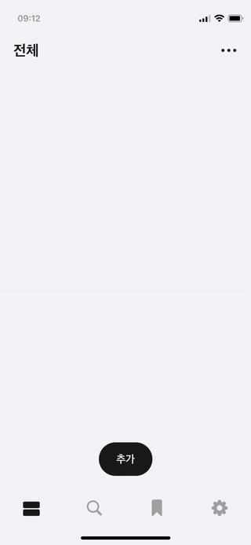
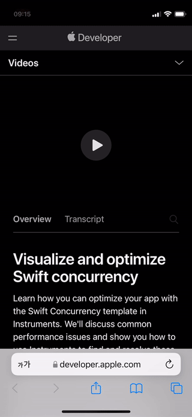
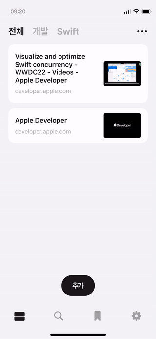
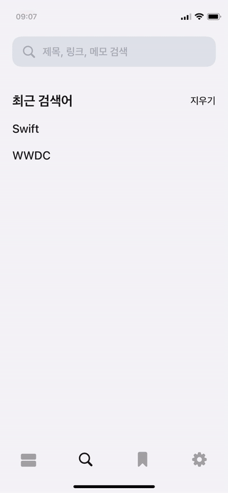
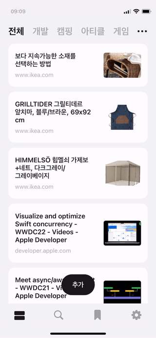
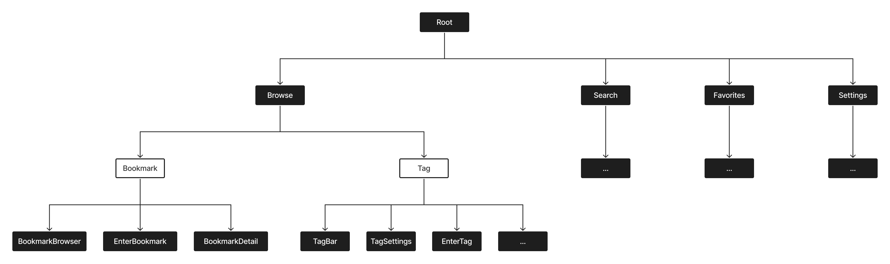
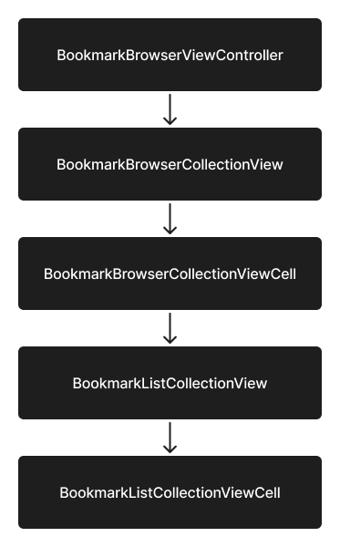
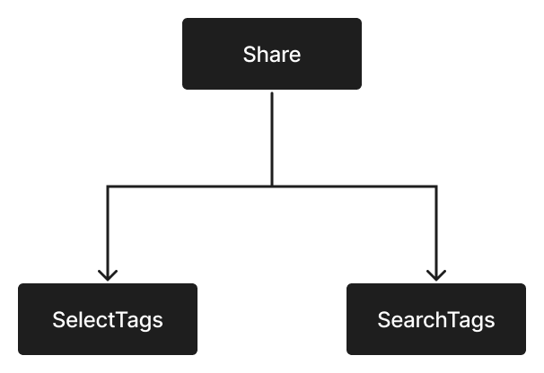
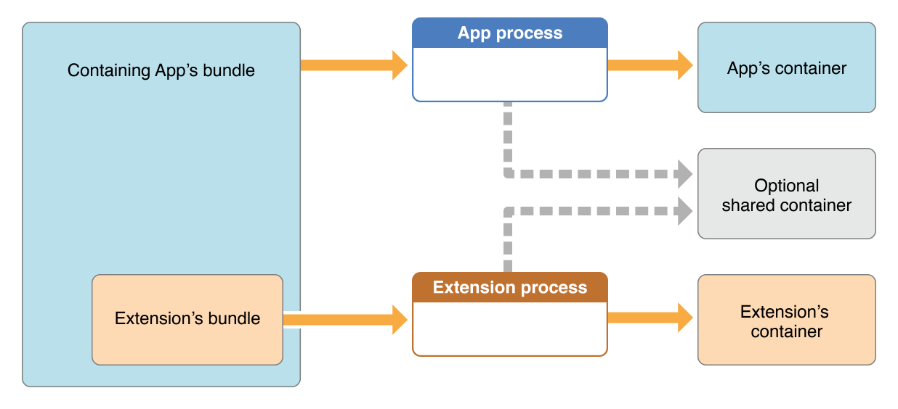

# Holder

> Core Data를 사용하여 북마크를 저장 및 백업하는 iOS 앱

<a href="https://apps.apple.com/kr/app/%ED%99%80%EB%8D%94/id1625219971?itsct=apps_box_badge&amp;itscg=30200"></a>

## 인덱스

- [기능](#기능)
  - [둘러보기](#둘러보기)
  - [추가](#추가)
  - [공유](#공유)
  - [디테일](#디테일)
  - [검색](#검색)
  - [즐겨찾기](#즐겨찾기)
- [설계 및 구현](#설계-및-구현)
  - [구조](#구조)
  - [RIB 간의 통신](#rib-간의-통신)
  - [데이터 저장 및 백업](#데이터-저장-및-백업)
  - [북마크 브라우저](#북마크-브라우저)
  - [Share Extension](#share-extension)
- [트러블슈팅](#트러블슈팅)
  - [모달을 끌어내려서 닫는 경우의 RIB 분리](#모달을-끌어내려서-닫는-경우의-rib-분리)
  - [내비게이션 스와이프를 통해 뒤로 이동하는 경우의 RIB 분리](#내비게이션-스와이프를-통해-뒤로-이동하는-경우의-rib-분리)
  - [앱과 Share Extension 간의 데이터 공유](#앱과-share-extension-간의-데이터-공유)
  - [앱 실행 중 외부에서 공유한 경우의 뷰 업데이트](#앱-실행-중-외부에서-공유한-경우의-뷰-업데이트)

## 기능

### 둘러보기

북마크 브라우저를 스와이프하거나 특정 태그를 선택하면 해당하는 북마크를 표시한다.


### 추가

필요에 따라 태그를 달고 메모를 입력해 북마크를 추가할 수 있다.



### 공유

공유 시트를 사용해 외부에서 앱으로 북마크를 공유할 수 있다.



### 디테일

링크에 해당하는 페이지를 표시한다.



### 검색

제목, 링크 및 메모로 검색이 가능하고, 검색 결과가 존재하면 최근 검색어가 추가된다.



### 즐겨찾기

즐겨 찾는 북마크를 즐겨찾기에 추가하거나 제거할 수 있다.



## 설계 및 구현

### 구조

첫 번째 앱을 출시하기 위해 기획을 구상하는데 앱의 구조가 쉽게 그려지지 않았다. 아키텍처를 활용하면 도움이 될까 싶어 알아보던 중 RIBs를 발견했다. RIBs를 사용하면 뷰가 아닌 비즈니스 로직을 중심으로 구조화할 수 있다기에 직관적으로 설계할 수 있을 것 같아 선택하게 되었다.

RIBs는 Uber에서 만든 모바일 크로스 플랫폼 아키텍처 프레임워크로, 해당 이름은 아키텍처의 핵심 요소인 Router, Interactor, Builder를 의미한다. 각각의 클래스는 라우팅, 비즈니스 로직, RIB 생성, 뷰 로직과 같은 고유한 책임을 가지므로 비즈니스 로직과 뷰 로직의 결합도를 낮출 수 있다.

하나의 RIB은 다음과 같은 요소로 구성된다.

- 인터랙터(interactor): RIB의 두뇌와 같은 역할로, 비즈니스 로직을 포함한다. Rx 스트림 구독, 상태 변경, 데이터 저장, 자식 RIB 연결 등 모든 결정을 내린다.
- 라우터(router): 자식 RIB을 연결 및 분리(attach/detach)한다. 인터랙터에서 라우팅 로직을 제외함으로써 인터랙터를 작게 유지할 수 있다.
- 빌더(builder): RIB의 모든 클래스와 자식 RIB의 빌더를 인스턴스화한다. 빌더는 의존성을 인식해야 하는 유일한 요소다.
- 프레젠터(presenter): 비즈니스 모델과 뷰 모델 간의 변환을 담당한다. 변환이 간단한 경우 생략이 가능하다.
- 뷰(view): UI 인스턴스화, 레이아웃, 사용자 인터랙션 처리, 애니메이션 등을 담당한다. 뷰는 단지 UI와 정보를 표시하는 용도이며, 생략이 가능하다.
- 컴포넌트(component): RIB을 구축하는 데 필요한 외부 의존성과 자체적으로 생성한 의존성을 소유하고 다른 RIB에 주입할 수 있도록 한다.



RIB 트리는 기능 또는 상태를 노드로 가지며, 이 트리를 기반으로 앱의 구조를 결정하는 것이 RIBs의 핵심이다.

먼저, 앱이 런칭되면 `AppDelegate`에서 `Root` 빌더를 생성하고 라우터를 실행한다. `Root` 인터랙터가 활성화되면 라우터에 자식 RIB을 연결하도록 지시하고, 라우터는 자식 RIB으로 `Browse`, `Search`, `Favorites`, `Settings`를 연결하고 뷰를 구성한다. 나머지 하위 RIB들도 이러한 패턴으로 빌더를 생성하고, 필요에 따라 의존성을 주입하고, 라우터를 연결하며, 뷰를 구성한다.

RIB 트리에서 `Bookmark` 및 `Tag`와 같이 선으로만 표현된 RIB은 뷰를 포함하지 않는 Viewless RIB을 의미한다. Viewless RIB은 자식 RIB 간의 전환이 목적이며, `Bookmark` 및 `Tag` 역시 자식 RIB을 관리하고 `Browse`를 작게 유지하기 위해 존재한다.

### RIB 간의 통신

인터랙터가 로직에 대한 결정을 내릴 때, completion과 같은 이벤트를 다른 RIB에 알리거나 데이터를 전달해야 할 수 있다. 이러한 경우 통신을 용이하게 하는 RIBs의 몇 가지 패턴을 활용한다.

통신이 부모 RIB에서 자식 RIB으로 향하는 경우, Rx 스트림(stream) 또는 `build(withListener:)` 메서드를 통해 데이터를 전달한다. Rx 스트림은 정적 의존성(static dependency)으로써 빌더 생성 시 주입 받으며, 해당 RIB이 연결된 후 데이터가 변하는 경우에 사용한다. 반면 `build(withListener:)` 메서드는 빌더 생성 이후에 동적 의존성(dynamic dependency)을 주입 받으며, 데이터가 불변인 경우에 사용한다.

둘 이상의 RIB이 서로 알지 못하지만 부모 RIB이 동일한 경우에도 Rx 스트림이 쓰이는데, 부모 RIB이 Rx 스트림을 생성하고 자식 RIB 모두에게 의존성으로 주입하는 방식이다. 앱의 사례를 보면 부모 RIB인 `Browse`가 현재 선택된 태그를 나타내는 `currentTagStream`을 생성하고, 자식 RIB인 `Bookmark` 및 `Tag`의 빌더 생성 시 해당 스트림을 포함한 의존성을 주입한다.

```swift
final class BrowseComponent: Component<BrowseDependency>, BookmarkDependency, TagDependency {
    let currentTagStream = MutableStream<Tag>(initialValue: Tag(name: ""))
}

final class BrowseBuilder: Builder<BrowseDependency>, BrowseBuildable {
    func build(withListener listener: BrowseListener) -> BrowseRouting {
        // ...
        let component = BrowseComponent(dependency: dependency)
        let bookmark = BookmarkBuilder(dependency: component)
        let tag = TagBuilder(dependency: component)
        return BrowseRouter(interactor: interactor,
                            viewController: viewController,
                            bookmark: bookmark,
                            tag: tag)
    }
}
```

`EnterBookmark`는 북마크 입력에 대한 RIB으로, 부모 RIB에 연결될 때 `build(withListener:)` 메서드를 통해 추가 또는 편집과 같은 입력 모드를 나타내는 `EnterBookmarkMode` 타입의 의존성을 주입 받는다.

```swift
final class EnterBookmarkBuilder: Builder<EnterBookmarkDependency>, EnterBookmarkBuildable {
    func build(withListener listener: EnterBookmarkListener, mode: EnterBookmarkMode) -> EnterBookmarkRouting {
        // ...
    }
}

final class BookmarkRouter: Router<BookmarkInteractable>, BookmarkRouting {
    func attachEnterBookmark(mode: EnterBookmarkMode) {
        let router = enterBookmark.build(withListener: interactor, mode: mode)
        // ...
    }
}
```

통신이 자식 RIB에서 부모 RIB으로 향하는 경우, 리스너(listener)를 통해 통신한다. 부모 RIB은 리스너 프로토콜을 준수하고, 자식 RIB이 호출할 수 있도록 자식 RIB의 리스너로 자신을 지정한다. 부모 RIB이 자식 RIB의 Rx 스트림을 직접 구독하도록 하는 대신 이 패턴을 사용하면, 메모리 릭(memory leak)을 방지할 수 있고 자식 RIB을 연결 및 분리할 때 스트림을 관리할 필요가 없다는 이점이 있다.

```swift
// MARK: - BookmarkBrowser

protocol BookmarkBrowserListener: AnyObject {
    func bookmarkBrowserBookmarkDidTap(bookmarkEntity: bookmarkEntity)
}

final class BookmarkBrowserInteractor: PresentableInteractor<BookmarkBrowserPresentable>, BookmarkBrowserInteractable, BookmarkBrowserPresentableListener {
    weak var listener: BookmarkBrowserListener?
    
    func bookmarkDidTap(bookmarkEntity: BookmarkEntity) {
        listener?.bookmarkBrowserBookmarkDidTap(bookmarkEntity: bookmarkEntity)
    }
}

// MARK: - Bookmark

protocol BookmarkInteractable: Interactable, BookmarkBrowserListener {
    // ...
}

final class BookmarkRouter: Router<BookmarkInteractable>, BookmarkRouting {
    func attachBookmarkBrowser() {
        let router = bookmarkBrowser.build(withListener: interactor)
        // ...
    }
}

final class BookmarkInteractor: Interactor, BookmarkInteractable {
    func bookmarkBrowserBookmarkDidTap(bookmarkEntity: BookmarkEntity) {
        // ...
    }
}
```

### 데이터 저장 및 백업

홀더 앱에서는 데이터를 저장하고 백업하기 위해 Core Data를 사용한다. 디바이스의 Core Data 스토어에 데이터가 저장되면, Core Data가 CloudKit 개인 데이터베이스(private database)에 자동으로 미러링해 백업하는 방식이다. 따라서 iOS에 로그인한 iCloud 계정이 동일하다면, 앱 재설치 시 로컬 스토어가 자동으로 동기화된다.

| 클래스 | 개요 |
| -- | -- |
| NSPersistentCloudKitContainer | Core Data Stack으로 불리는 `NSManagedObjectModel`, `NSManagedObjectContext`, `NSPersistentStoreCoordinator`를 캡슐화하고, CloudKit 개인 데이터베이스에 스토어를 미러링한다. |
| NSManagedObjectModel | .xcdatamodeld 파일의 프로그래밍 방식 표현이다. 스키마의 엔티티를 나타내는 `NSEntityDescription`을 포함하며, Core Data는 `NSEntityDescription`을 사용해 오브젝트와 스키마 간의 매핑을 수행한다. |
| NSManagedObjectContext | `NSManagedObject`의 변경 사항을 추적하는 역할로, 스토어에서 오브젝트를 검색하거나 가져오고 해당 오브젝트의 변경 사항을 스토어에 커밋하거나 취소할 수 있다. 또한 새 오브젝트를 추가하거나 가져온 오브젝트를 삭제할 수 있다. |
| NSPersistentStoreCoordinator | 스토어에 대한 액세스를 제공하며, 컨텍스트가 오브젝트를 스토어에 저장하고 검색할 수 있도록 한다. |
| NSManagedObject | 모델의 동작을 구현하는 기본 클래스로, 연관된 컨텍스트를 포함한다. 서브클래스를 정의하고 로직을 구현할 수 있다. |
| NSFetchRequest | 스토어에서 데이터를 검색하는 데 사용하며, 필터링 및 정렬 기준을 지정할 수 있다. |
| NSFetchedResultsController | 스토어에서 가져온 결과를 관리하고 데이터를 표시하는 데 사용한다. 델리게이트를 설정하면 컨텍스트로부터 변경 알림을 수신하고 테이블 뷰 또는 컬렉션 뷰를 업데이트할 수 있다. |

구현 과정은 다음과 같다.

1. 프로젝트의 Signing & Capabilities 탭에서 iCloud Capability를 추가한 후 CloudKit을 선택하고 컨테이너를 설정한다. 다음으로 Background Modes Capability를 추가하고 Remote notifications를 선택해 새로운 컨텐츠를 사용할 수 있을 때 자동으로 알림을 받도록 한다.
2. 데이터 모델 에디터(data model editor)를 통해 엔티티의 속성(attribute) 및 관계(relationship)를 정의하고 `NSManagedObject` 서브클래스를 생성한다.
3. [PersistentContainer](https://github.com/meregrey/holder/blob/main/Holder/Holder/Common/Persistence/PersistentContainer.swift)를 통해 `NSPersistentCloudKitContainer` 타입의 컨테이너를 생성하고 스토어를 로드한다. `PersistentContainer`는 `NSManagedObjectContext` 타입의 두 가지 컨텍스트를 제공하는데, 동기화 시 UI를 자동으로 업데이트할 수 있도록 하는 메인 큐(main queue) 관련 `viewContext`와 프라이빗 큐(private queue)에서 실행되는 `backgroundContext`를 반환한다.
4. [BookmarkRepository](https://github.com/meregrey/holder/blob/main/Holder/Holder/Common/Repositories/BookmarkRepository.swift) 및 [TagRepository](https://github.com/meregrey/holder/blob/main/Holder/Holder/Common/Repositories/TagRepository.swift)에서 `PersistentContainer`의 컨텍스트를 사용해 데이터 작업을 수행한다. 데이터 가져오기의 경우, `NSFetchedResultsController`를 반환해 테이블 뷰 또는 컬렉션 뷰를 데이터와 동기화된 상태로 유지할 수 있도록 한다.

### 북마크 브라우저

`BookmarkBrowser` 빌더 생성 시 의존성으로 `MutableStream<Tag>` 타입의 `currentTagStream`을 주입 받는다. [MutableStream](https://github.com/meregrey/holder/blob/main/Holder/Holder/Common/Utils/Stream.swift)은 `ReadOnlyStream`을 상속하는 제네릭 클래스로, 읽기 전용인 `ReadOnlyStream`과 달리 이벤트를 방출할 수 있다. `currentTagStream`이 mutable인 이유는 북마크 브라우저 스와이프 시 스트림을 업데이트해 태그 바가 현재 태그를 선택하도록 하기 위해서다.

북마크 브라우저의 뷰 계층은 다음과 같이 구성된다.

<p align="center"></p>

| 클래스 | 개요 |
| -- | -- |
| BookmarkBrowserViewController | `BookmarkBrowserCollectionView` 타입의 컬렉션 뷰를 포함한다. `collectionView(_:cellForItemAt:)` 메서드에서 셀의 `listener`로 인터랙터를 전달한다. |
| BookmarkBrowserCollectionView | `BookmarkBrowserCollectionViewCell` 타입의 셀을 포함한다. |
| BookmarkBrowserCollectionViewCell | `BookmarkListCollectionView` 타입의 컬렉션 뷰와 `BookmarkListCollectionViewManager` 타입의 매니저를 포함한다. `configure(listener:tag:)` 메서드에서 매니저를 생성하고 컬렉션 뷰의 `dataSource`, `prefetchDataSource`, `delegate`로 지정한다. |
| BookmarkListCollectionView | `BookmarkListCollectionViewCell` 타입의 셀을 포함한다. |
| BookmarkListCollectionViewCell | 셀을 구성하는 `configure(with:)` 메서드에서 [BookmarkViewModel](https://github.com/meregrey/holder/blob/main/Holder/Holder/Common/ViewModels/BookmarkViewModel.swift) 타입의 뷰 모델에 썸네일 관련 클로저를 바인딩하는데, 이는 셀 재사용 시 URL에 해당하지 않는 썸네일이 표시되는 것을 방지하기 위해서다. 메서드가 호출될 때마다 새로운 뷰 모델을 전달 받아 바인딩하기 때문에, 이전 뷰 모델이 더이상 참조되지 않으므로 이전 클로저가 실행되지 않는다. |
| BookmarkListCollectionViewManager | `NSFetchedResultsController`를 사용해 컬렉션 뷰를 구성하고, `collectionView(_:prefetchItemsAt:)` 메서드에서 [ThumbnailLoader](https://github.com/meregrey/holder/blob/main/Holder/Holder/Common/Utils/ThumbnailLoader.swift)를 통해 썸네일을 미리 로드하는 작업을 수행한다. |
| ThumbnailLoader | [Cache](https://github.com/meregrey/holder/blob/main/Holder/Holder/Common/Utils/Cache.swift) 타입의 캐시를 포함한다. URL에 해당하는 이미지가 캐시에 존재하면 바로 클로저에 전달하고, 그렇지 않으면 `LPMetadataProvider`를 통해 해당 URL에 대한 이미지를 가져온 후 캐시에 저장하고 클로저에 전달한다. |
| Cache | 생성 비용이 많이 드는 데이터를 임시로 저장한다. 키와 값(key-value)의 타입으로 클래스만 사용할 수 있는 `NSCache`와 달리, `Cache`는 키와 값을 자동으로 래핑하므로 클래스가 아닌 타입도 사용이 가능하다. 내부적으로 `NSCache`에 저장하기 때문에 메모리가 부족한 경우 일부 항목이 제거된다. |

### Share Extension

Share Extension은 현재 컨텍스트의 정보를 앱 및 기타 서비스와 공유할 수 있는 편리한 기능을 제공한다. 사용자가 쉽고 빠르게 원하는 정보를 공유할 수 있다는 점이 앱의 취지에 맞아 해당 기능을 구현했다.

구현 과정으로는 먼저 프로젝트에 Share Extension 타겟을 추가한다. 이때 기본적으로 생성되는 스토리보드와 뷰 컨트롤러는 Share Extension을 실행하면 표시할 UI를 구성하는 용도로 사용된다. 이 뷰 컨트롤러의 `viewDidLoad()` 메서드가 호출되면, `Share` RIB을 활성화하고 현재 공유하려는 URL을 로드한다. `Share`는 `SelectTags` 및 `SearchTags`를 자식 RIB으로 포함하는데, Holder 타겟의 RIB을 재사용함으로써 앱에서의 북마크 추가 기능을 추가적인 구현 없이 Share Extension에서도 활용할 수 있다.

<p align="center"></p>

다음으로 뷰 컨트롤러의 `extensionContext`를 통해 URL을 로드한다. `extensionContext`는 `NSExtensionContext?` 타입으로, 뷰 컨트롤러가 Extension에 사용되면 값을 갖는다. 이렇게 URL을 로드하면 `BookmarkRepository`를 통해 중복 여부를 확인한 후, 결과에 따라 북마크 입력 화면 또는 중복 안내 화면을 표시하게 된다.

## 트러블슈팅

### 모달을 끌어내려서 닫는 경우의 RIB 분리

모달을 끌어내려서 닫으면 뷰는 정상적으로 해제되지만 RIB이 존재하는 문제가 발생했다. 이 문제는 뷰 dismiss 시 알림을 받아 해당 시점에 RIB을 분리하는 방식으로 해결이 가능한데, 트랜지션 관련 알림 수신은 `UIAdaptivePresentationControllerDelegate` 프로토콜을 활용해 구현할 수 있다. `UIAdaptivePresentationControllerDelegate`는 프레젠테이션 스타일 및 트랜지션과 같은 특성 변경에 응답하는 메서드를 제공하는 프로토콜이다.

구현 과정은 다음과 같다.

1. `UIAdaptivePresentationControllerDelegate`를 채택하는 [AdaptivePresentationControllerDelegateProxy](https://github.com/meregrey/holder/blob/main/Holder/Holder/Common/Utils/AdaptivePresentationControllerDelegateProxy.swift) 클래스를 정의하고, 인터랙터의 `presentationProxy` 프로퍼티에 `AdaptivePresentationControllerDelegateProxy` 인스턴스를 할당한다. 인터랙터 자체가 `UIAdaptivePresentationControllerDelegate`를 채택하지 않도록 하는 이유는 UIKit을 알지 못하게 하기 위해서다.
2. 인터랙터가 `AdaptivePresentationControllerDelegate` 프로토콜을 준수하도록 하고 `presentationControllerDidDismiss()` 메서드를 구현한 후, 초기화 시 `presentationProxy.delegate`에 `self`를 할당한다.
3. 라우터에서 RIB 연결 시 뷰의 `presentationController?.delegate`에 인터랙터의 `presentationProxy`를 할당한다.

```swift
// MARK: - Interactor

final class BookmarkInteractor: Interactor, BookmarkInteractable, AdaptivePresentationControllerDelegate {
    let presentationProxy = AdaptivePresentationControllerDelegateProxy()
    
    override init() {
        super.init()
        self.presentationProxy.delegate = self
    }
    
    func presentationControllerDidDismiss() {
        router?.detachEnterBookmark(includingView: false, forNavigation: false)
    }
}

// MARK: - Router

protocol BookmarkInteractable: Interactable, BookmarkBrowserListener, EnterBookmarkListener, BookmarkDetailListener {
    var presentationProxy: AdaptivePresentationControllerDelegateProxy { get }
}

final class BookmarkRouter: Router<BookmarkInteractable>, BookmarkRouting {
    func attachEnterBookmark(mode: EnterBookmarkMode, forNavigation isForNavigation: Bool) {
        // ...
        viewController.uiviewController.presentationController?.delegate = interactor.presentationProxy
        baseViewController.present(viewController, modalPresentationStyle: .pageSheet, animated: true)
    }
}
```

### 내비게이션 스와이프를 통해 뒤로 이동하는 경우의 RIB 분리

내비게이션 스택에서 상위 뷰 컨트롤러의 pop이 동작하지 않는 문제가 발생했다. 내비게이션 바를 숨긴 채 push한 상황으로, 내비게이션 바가 숨겨지면서 내비게이션 컨트롤러의 `interactivePopGestureRecognizer`가 비활성화되는 것이 원인이라고 한다. 따라서 `NavigationController` 클래스가 `UIGestureRecognizerDelegate` 프로토콜을 채택하고 `interactivePopGestureRecognizer?.delegate`에 `self`를 할당하는 방식으로 해결했다.

```swift
final class NavigationController: UINavigationController, UIGestureRecognizerDelegate, ViewControllable {
    private func configureViews() {
        // ...
        interactivePopGestureRecognizer?.delegate = self
    }
}
```

다음으로 스와이프를 통해 뒤로 이동하면 뷰는 정상적으로 해제되지만 RIB이 존재하는 문제가 발생했다. 이를 해결하기 위해 뷰 컨트롤러가 내비게이션 컨트롤러에서 제거되는 시점에 호출되는 `didMove(toParent:)` 메서드를 재정의해 리스너에 알리도록 구현했다.

```swift
final class BookmarkDetailViewController: UIViewController, BookmarkDetailPresentable, BookmarkDetailViewControllable {
    override func didMove(toParent parent: UIViewController?) {
        super.didMove(toParent: parent)
        if parent == nil { listener?.didRemove() }
    }
}
```

### 앱과 Share Extension 간의 데이터 공유

외부의 공유 시트에서 북마크를 저장하는 경우, 기존의 태그를 가져오지 못하는 문제가 발생했다. Holder 및 Share Extension이 서로 다른 타겟이기 때문에 Core Data 스토어를 공유하지 못하는 것이 원인이었다. Extension 번들이 앱 번들 내에 중첩되더라도, 실행 중인 앱과 Extension은 서로의 컨테이너에 직접 접근할 수 없다.

<p align="center"></p>

> 출처: [App Extension Programming Guide](https://developer.apple.com/library/archive/documentation/General/Conceptual/ExtensibilityPG/ExtensionScenarios.html#//apple_ref/doc/uid/TP40014214-CH21-SW1)

해당 문제는 앱과 Extension 간에 공유 컨테이너를 생성함으로써 해결이 가능하다. 먼저 각 타겟의 Signing & Capabilities 탭에서 App Groups Capability를 추가한다. 다음으로 App Group 식별자를 사용해 공유 컨테이너의 URL을 가져오고, Core Data 스토어에 해당 URL을 지정하도록 개선한다.

```swift
final class PersistentContainer: PersistentContainerType {
    private let dataModelName = "PersistenceModel"
    private let appGroupIdentifier = "group.com.yeojin-yoon.holder"
    
    private lazy var container: NSPersistentCloudKitContainer = {
        let container = NSPersistentCloudKitContainer(name: dataModelName)
        let storeDescription = NSPersistentStoreDescription(url: containerURL())
        container.persistentStoreDescriptions = [storeDescription]
        // ...
        return container
    }()
    
    private func containerURL() -> URL {
        guard let url = FileManager.default.containerURL(forSecurityApplicationGroupIdentifier: appGroupIdentifier) else { return URL(fileURLWithPath: "") }
        return url.appendingPathComponent("\(dataModelName).sqlite")
    }
}
```

### 앱 실행 중 외부에서 공유한 경우의 뷰 업데이트

앱 실행 중 외부에서 공유 시, 저장된 데이터를 앱의 화면에 표시해야 한다. 저장이 발생한 것을 알리기 위해 앱과 Extension 간에 노티피케이션을 전달하고자 했지만 해당 방법은 불가했다. 앱과 Extension이 별도의 프로세스로 실행되고, `NotificationCenter`는 단일 프로세스 내에서만 노티피케이션을 전달할 수 있는 것이 원인이었다.

결과적으로 공유 일자를 저장하고 관찰하는 방식으로 해결했는데, 이를 구현하기 위해 [UserDefaults](https://github.com/meregrey/holder/blob/main/Holder/Holder/Common/Utils/Extensions/UserDefaults.swift)를 사용했다. `UserDefaults` 인스턴스 생성 시 `suiteName`으로 App Group 식별자를 전달하면, 지정된 App Group에 해당하는 앱과 Extension이 데이터를 공유할 수 있다.

구현 과정은 다음과 같다.

1. Share Extension을 통해 북마크 저장 시, `Share` RIB에서 `UserDefaults`에 공유 일자를 저장한다.

```swift
final class ShareInteractor: Interactor, ShareInteractable, ShareViewControllerListener {
    func saveButtonDidTap(bookmark: Bookmark) {
        // ...
        updateLastShareDate()
    }
    
    private func updateLastShareDate() {
        guard let userDefaults = UserDefaults(suiteName: UserDefaults.suiteName) else { return }
        userDefaults.set(Date(), forKey: UserDefaults.suiteKey)
    }
}
```

2. `Root` RIB에서 `lastShareDate`를 관찰하고, 값이 저장되면 노티피케이션을 발송한다.

```swift
final class RootInteractor: PresentableInteractor<RootPresentable>, RootInteractable, RootPresentableListener {
    private let userDefaults = UserDefaults(suiteName: UserDefaults.suiteName)
    private var observation: NSKeyValueObservation?
    
    override func didBecomeActive() {
        // ...
        observeLastShareDate()
    }
    
    private func observeLastShareDate() {
        observation = userDefaults?.observe(\.lastShareDate, options: [.new]) { _, _ in
            NotificationCenter.post(named: NotificationName.lastShareDateDidChange)
        }
    }
}
```

3. 북마크 및 태그 관련 RIB에서 노티피케이션을 수신하고 뷰를 업데이트한다.

```swift
final class BookmarkListInteractor: PresentableInteractor<BookmarkListPresentable>, BookmarkListInteractable, BookmarkListPresentableListener, BookmarkListCollectionViewListener {
    override func didBecomeActive() {
        // ...
        registerToReceiveNotification()
    }
    
    private func registerToReceiveNotification() {
        NotificationCenter.addObserver(self,
                                       selector: #selector(lastShareDateDidChange),
                                       name: NotificationName.lastShareDateDidChange)
    }
}
```
